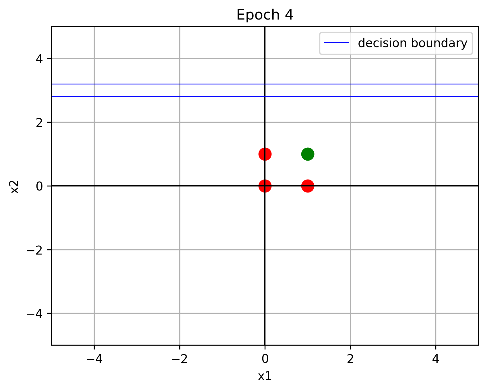
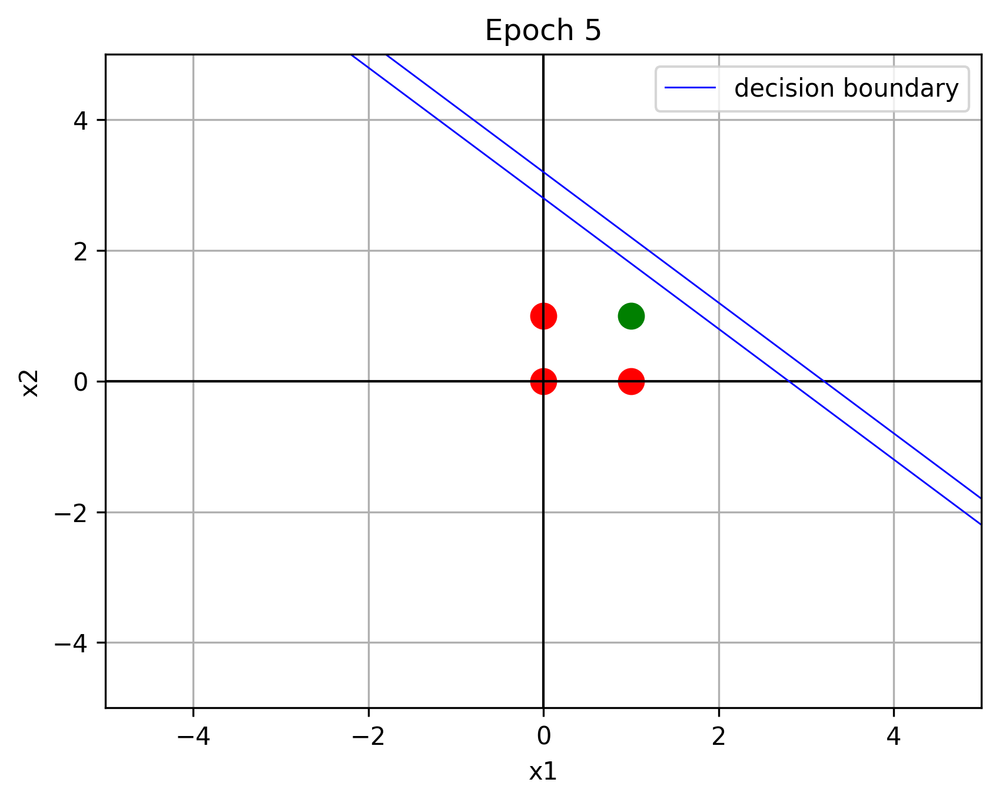
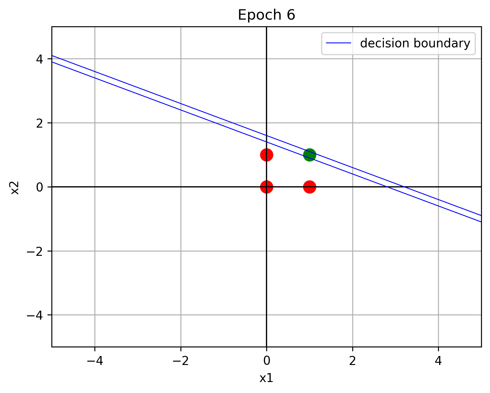
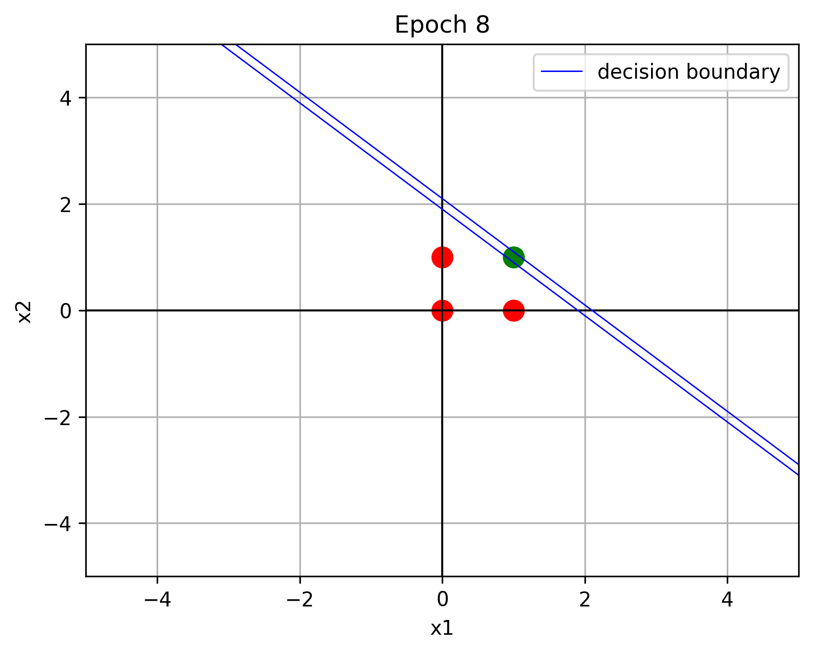
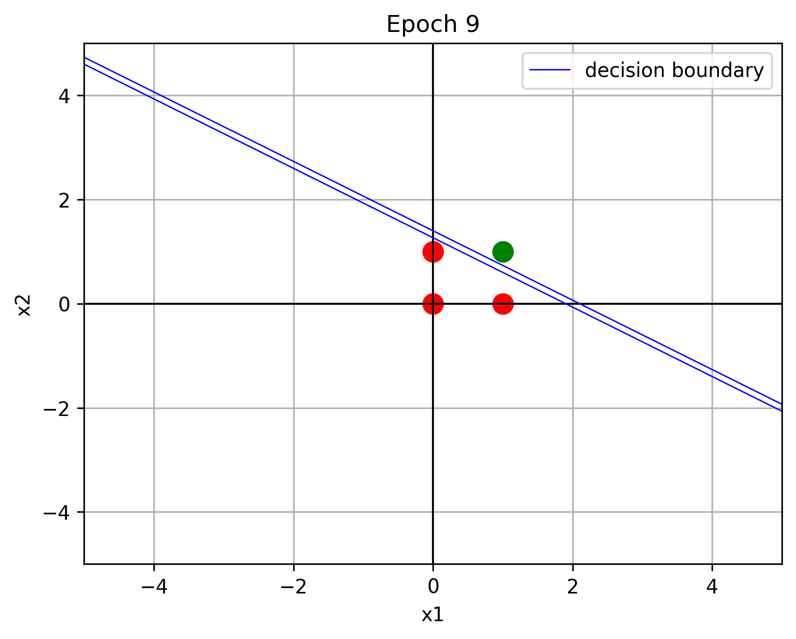

# Perceptron Learning of the AND Function

This project demonstrates how a **single-layer perceptron** can learn the **logical AND function**, based on Example 2.5 from *Fundamentals of Neural Networks* by Laurene Fausett. The perceptron is trained using the **standard learning rule** to adjust its weights over multiple epochs until it correctly classifies all inputs. This provides a hands-on example of how a neuron can form a **linear decision boundary** to separate two classes.

The implementation is in **Python** using **NumPy** and **Matplotlib**, and it visualizes the perceptron’s training process. Each epoch generates a plot showing the training points (green = 1, red = -1) and the evolving decision boundary.

### Training Snapshots

|            Epoch 4            |            Epoch 5            |            Epoch 6            |            Epoch 8            |            Epoch 9            |
| :---------------------------: | :---------------------------: | :---------------------------: | :---------------------------: | :---------------------------: |
|  |  |  |  |  |

This project is ideal for **educational purposes**, helping beginners see how weights evolve during training and how the perceptron forms a simple classification boundary.
